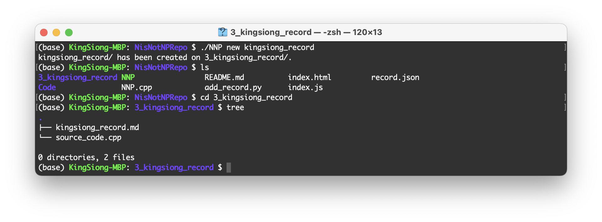

# N is Not NP's Code Repository

## Introduction

pass, leave this to someone else...(Lu? Zhu?)

## Usage

### Add A Code Record

First, git clone this reposity. If you have this cloned, git pull origin main to update it.

Second, there are two steps to add your record to this repo by using `./NNP` (which is short of 'N is Not NP', maybe... and i am not sure) :

-  Run(if it don't work, `g++ NNP.cpp -o NNP`)

  ```shell
  $ ./NNP new/n you_record_name
  ```

  and you will get a new folder named index_you_record_name(i did not deal with blank space(lazy boy...), so replace blank space with `_` if there are blank spaces.) under  `./` with two files. Following is an example:

  

  After this, you should complete the information in `*.md` and copy your code to `*.cpp`. 

- Run

  ```shell
  $ ./NNP submit/s you_record_name
  ```

Simple work! All stuff were done. 

Lastly, git push and refresh the web page to see the changes.

### Bug Fix or New Feature

I hardly write javascript and python, so what i wrote is akward. In this case, i wish you to fix some bugs or add more features.

For bug fix: 

`git branch` a new branch named `bugfix/you_name`, you can run `python -m http.server` to debug locally. 

For new feature:

`git branch` a new branch named `feature/you_name_something`.

`git push` && add a pull request, I will review code changes afterwards. Thanks. :)

